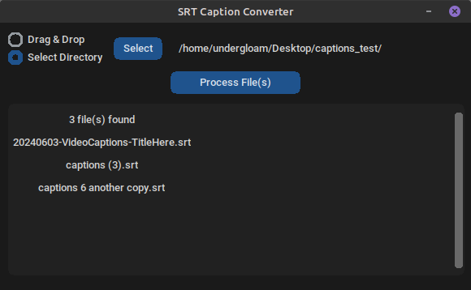
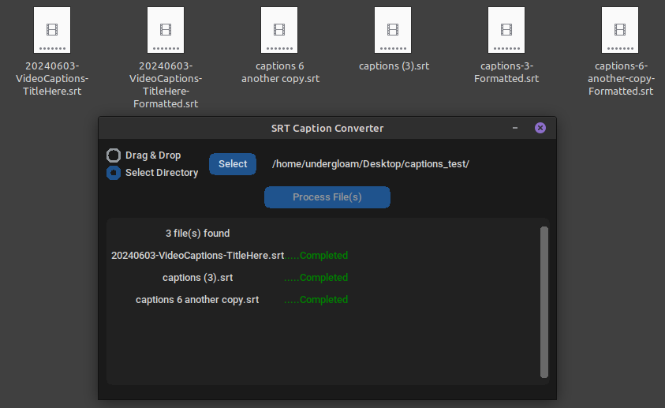

# SRT Caption Converter

SRT Caption Converter (SRTCC) allows people working in video production to quickly and easily transform SRT caption files from a web-ready format to one meeting the requirements of traditional broadcast captioning.

## What SRTCC Does:
SRTCC takes in an SRT file (or group of SRT files) and checks the text lines to ensure that they have a maximum of 32 characters. If needed, it combines or splits up lines with too few or too many characters, leaving the numeric sequencing and time code lines intact. It then saves the changed structure as a new SRT file in the same location as the original file with 'Formatted' at the end of the file's name for easy distinction between the old and new files. This process also converts the file encoding from UTF-8 (used by web platforms) to Latin-1, which is compatible with Adobe Premiere Pro and other common editing software to avoid any charset incompatibility issues.

## What SRTCC Doesn't Do:
Change your file in any way beyond caption line lengths and encoding. Your sequencing and time codes will remain exactly as they are, as will the actual content of your captions (with the exception of substituting Latin-1 characters for equivalent UTF8 ones).

## How to Use SRTCC:
1. **Download** the source code from the latest [release](https://github.com/cmstempert/srt-caption-converter/releases).
3. **Extract** the source doe from its compressed format. The executables are location in "build" folders of their respective platforms. Linux (Ubuntu 22.04.3) and macOS (Sonoma) are currently supported. Previous versions of these platforms may also work, but have not been tested.
4. **Run** the file by double-clicking. (On macOS you may have to first move the file to the "Applications" directory before it will execute.)
5. **Select Files** by either choosing a directory for it to scan for all present SRT files or by dragging and dropping files into the indicated field (not available on macOS).

   
    * *Choose a Directory (all platforms)*: Clicking the "Select" button will open a file dialog. Navigate to the directory where your SRT file is stored. SRTCC will scan the selected directory for files with the extension '.srt' and display eligible files in the box below for your review.
    * *Drag & Drop (Linux only)*: Drag a file or group of files into the "Drag & Drop" box. SRTCC will evaluate the files for the '.srt' extension and display eligible files in the box below for your review.
6. **Process Files** that have been selected. The screen will show "Completed" when the files are ready for use.
   

## Planned Features
* Ability to delete individual files that have been loaded into SRTCC. (Currently, the only way to remove a selected SRT file from the queue is to click the 'Select' directory button and open the file dialog, which will reset the entire queue.

## Repository Contents
This repo contains all the necessary components to create the executable, including platform-specific scripts, requirements lists, PyInstaller spec files, and the latest build/dist directories.
